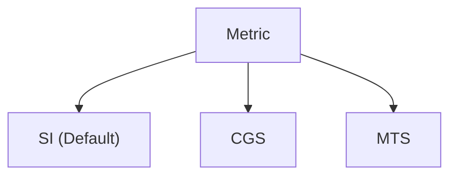

Metric units have 3 sub systems

```mermaid
graph TD
    Metric --> SI["SI (Default)"]
    Metric --> CGS
    Metric --> MTS
```

If we tried to get the unit type of sub system and not found then we should search for it in SI.